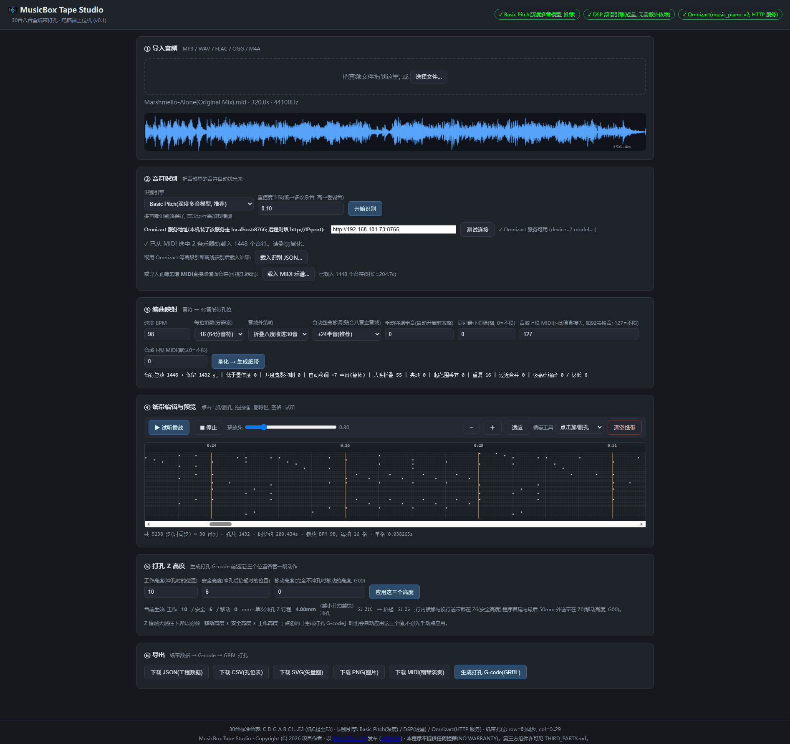
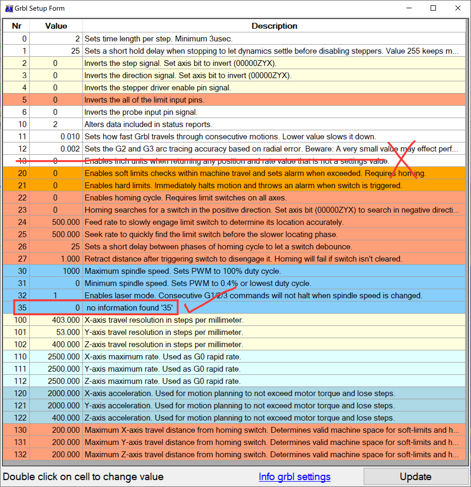

# 🎼 MusicBox Tape Studio

**项目主页 / 源码仓库 / 附件下载: <https://github.com/WenGong-0514/Music_box_punching_machine>**

[](https://github.com/WenGong-0514/Music_box_punching_machine)
[](https://github.com/WenGong-0514/Music_box_punching_machine/blob/main/LICENSE)
[](#快速开始)

> ⚠️ **AI Generated Project** — 本项目的电脑端全部代码均由 AI（大语言模型）在人工提示词引导下自动生成，**未经过专业人工代码审核**。仅供学习交流使用，使用者需自行承担所有风险。详见下方免责声明。

---

> 📢 **侵权联系删除** — 若本项目无意中使用了您的版权文件、素材、代码、图片、音频、视频或其他受保护内容，或存在侵犯您合法权益的情况，请通过 **stm32f103@qq.com** 联系我。核实后我会尽快删除相关文件或内容，并进行相应调整。感谢理解与支持。

## ⚠️ 免责声明

**本项目电脑端代码完全由 AI 生成，未经人工审核。** 克隆、使用、修改或分发本项目的任何行为所造成的直接或间接损失（包括但不限于数据丢失、财产损失、设备损坏、人身伤害、法律纠纷等），与项目作者无任何关系。使用者应当：

- 在使用前自行审查全部代码
- 了解本项目会生成驱动物理设备的 **G-code**，涉及机械运动与冲压动作，务必先空跑验证、确认行程与安全高度后再上机
- 自行承担使用本项目的所有风险和后果

---

**30 音纸带八音盒 · 打孔机上位机**
把音乐变成纸带孔位,并生成可直接驱动 GRBL 打孔机的 G-code。

本地 Web 应用(Python FastAPI 后端 + 浏览器原生 JS 前端,零构建依赖):
导入音频或乐谱 MIDI → 得到音符 → 量化到 30 音纸带 → 网格编辑 → 导出纸带/MIDI/图纸/**打孔 G-code**。

---

## 📦 附件与大型文件获取方式

> 本项目同时发布在 **GitHub** 与 **OSHWHub(立创开源硬件平台)**。OSHWHub 侧无法上传大型附件,
> 因此**大体积文件一律以 GitHub 为准** —— 两个平台的 README 是同一份,看到这节的链接即指向 GitHub 仓库。

**仓库地址(唯一权威来源):<https://github.com/WenGong-0514/Music_box_punching_machine>**

| 内容 | 体积 | 获取方式 |
|---|---|---|
| **全部源码 + 文档 + CAD 模型** | 约 11 MB | 直接 `git clone https://github.com/WenGong-0514/Music_box_punching_machine.git`(克隆即全都有) |
| **Omnizart 钢琴转录模型权重**(`music_piano-v2`) | 约 89 MB | **已随 GitHub 仓库分发**,克隆即得:`third_party/omnizart/checkpoints/music/music_piano-v2/` |
| **CAD 硬件模型**(`.prt` / `.step`) | 约 9.6 MB | 随仓库分发(已含在上面 11 MB 内),清单见 [docs/HARDWARE.md](docs/HARDWARE.md) |
| **Omnizart HTTP 引擎镜像** `omnizart-server-cpu.tar` | 约 1.04 GB | **不随仓库分发**(远超 GitHub 单文件 100 MB 限制)。在本地用 `docker build -f deploy_server/Dockerfile.portable -t omnizart:server .` 自行构建,步骤见 [deploy_server/SERVICE-INSTALL.md](deploy_server/SERVICE-INSTALL.md) |
| **Basic Pitch 引擎** wheel(`basic_pitch-0.4.0`) | 0.7 MB | 随仓库分发:`third_party/basic_pitch-0.4.0-py2.py3-none-any.whl`(ONNX 模型随 wheel 内嵌,免装 TensorFlow) |
| Demucs 分轨 WAV、导入音频、导出产物 | 数十~数百 MB | 不入库,由你本地生成:`python tools/source_separate.py <音频> --model htdemucs_6s` |
| 第三方版权内容(参考谱面、商业录音派生数据) | — | **有意不提供**,原因见 [THIRD_PARTY.md §4](THIRD_PARTY.md) |

> 📌 **完整仓库约 100 MB**:其中 89 MB 是上面那个 AI 模型权重,其余源码/文档/CAD 仅约 11 MB。

> 🔎 **从 OSHWHub 来的用户请注意**:下载 GitHub 上的大文件时,请用仓库页面的
> **`Code` → `Download ZIP`** 按钮,或直接 `git clone`(推荐,便于后续 `git pull` 更新)。
> 单个文件的直链在 `raw.githubusercontent.com` 上对 >50 MB 的文件不保证可用。

---

## 功能一览

- **两种输入方式**
  - **音频识别**:MP3/WAV/FLAC/OGG/M4A → 音符。内置 Basic Pitch(ONNX,快)、DSP 轻量引擎,以及可选的
    Omnizart 钢琴专用模型(经 HTTP 引擎服务调用,见下)。
  - **乐谱 MIDI 导入**:直接载入正确的 `.mid`,软件会列出各**乐器轨**(GM 音色 / 音符数 / 音域,
    鼓轨自动标灰),勾选一条或多条轨道 → 直接取谱面音符,**不再依赖从音频里猜音符**。
- **编曲量化**:自动整曲移调、冲突感知八度折叠、音域过滤、八度鬼影抑制、同列过近丢弃等策略,
  并提供完整统计(保留/折叠/丢弃/移调量…)。
- **纸带可视化编辑**:30 音轨 × 时间步网格;点击加删孔、拖拽擦除区域、空格试听(WebAudio 拨弦合成)。
- **导出**:JSON(工程数据)、CSV(孔位表)、SVG/PNG(图纸)、**MIDI**(给钢琴软件/DAW 演奏)、
  **G-code**(GRBL 打孔,含孔数/纸带长度/耗时预估注释)。
- **打孔路径规划**:同排多孔自动停带按 X 依次冲、每行从最近端进入、空行跳过、
  打孔阶段所有移动保持在安全高度、完全不冲孔时抬到移动高度(G00)、结束自动多送 100mm 便于剪带。

---

## 快速开始

```bat
:: 1) 依赖(推荐用工程内虚拟环境; Windows + Python 3.13 已实测)
python -m venv .venv
.venv\Scripts\python -m pip install -r requirements.txt

:: 2) Basic Pitch 引擎必须用仓库内 wheel 安装(原因见下)
.venv\Scripts\python -m pip install third_party\basic_pitch-0.4.0-py2.py3-none-any.whl --no-deps

:: 3) 启动
run.bat
```

然后浏览器打开 <http://127.0.0.1:8765>。

> **后端不运行 = 页面能打开但识别/下载全部失败**。`run.bat` 窗口关掉即等于关闭服务。

### 依赖安装要点

- **Basic Pitch 不要 `pip install basic-pitch`**:Windows + 新 Python 下它会强拉不兼容的 TensorFlow。
  本项目方案 = **仓库内 wheel + ONNX 运行时(免 TF)**:
  ```bat
  pip install third_party\basic_pitch-0.4.0-py2.py3-none-any.whl --no-deps
  pip install mir-eval pretty-midi "resampy<0.4.3" onnxruntime
  ```
- **`setuptools` 必须 < 81**:`basic_pitch` 运行时 `import pkg_resources`,而 setuptools ≥81 已移除该模块
  (`requirements.txt` 已固定)。
- 网络受限时加镜像:`-i https://pypi.tuna.tsinghua.edu.cn/simple`(可换阿里/腾讯镜像)。
- **Omnizart 引擎**不需要在本机装 TensorFlow:它由独立的 HTTP 引擎服务提供,
  部署见 [`deploy_server/SERVICE-INSTALL.md`](deploy_server/SERVICE-INSTALL.md);
  GUI ② 里填服务地址(`http://<ip>:8766`)→「测试连接」即可选用。服务不可达时该引擎会自动置灰并给出原因。

---

## 界面流程(六步)

1. **① 导入音频** — 拖入/选择音频,显示波形。
2. **② 音符识别** — 选择引擎,或用「载入识别 JSON」导入外部识别结果,
   或用「**载入 MIDI 乐谱…**」直接选乐器轨(推荐手上有正确乐谱时使用)。
3. **③ 编曲映射** — 设置 BPM、每拍格数、音域外策略(`折叠收进30音`/`夹到边界`/`丢弃`)、
   自动移调范围、音域上下限 → 生成纸带孔位。
4. **④ 纸带编辑预览** — 点击加/删孔、拖拽擦除、空格试听、`E` 切换工具、缩放/适应宽度。
5. **⑤ 打孔 Z 高度** — 生成打孔 G-code 前选定三个高度:**工作高度**(冲孔位)、
   **安全高度**(冲孔后抬起位,打孔阶段的行内横移与换行送带都在此)、
   **移动高度**(完全不冲孔时的高度,G00 首尾定位与尾部外送带)。
   约束 `移动 ≤ 安全 ≤ 工作`(Z 值越大越往下),选定值存进工程,重启后仍在。
6. **⑥ 导出** — JSON / CSV / SVG / PNG / **MIDI** / **G-code(GRBL)**。

快捷键:`Space` 播放/停止,`E` 切换编辑工具,滚轮 + `Ctrl` 缩放。

### 运行效果



> 浏览器打开 <http://127.0.0.1:8765> 后的实际界面:上半是 30 音 × 时间步的纸带网格(点击加删孔),
> 下半依次是导入 → 识别 → 编曲 → 编辑 → **打孔 Z 高度** → 导出。

---

## 硬件:打孔机与 G-code

本项目的打孔输出已按实机参数实现(坐标系、纸带几何、Z 三层、路径规划、GRBL 配置、耗时模型):

- **X** = 纸带横向(音调),**X0 = 纸带左边缘线**且为**冲针圆心**(无半径补偿);X+ 向右。
- **Y** = 纸带纵向(时间),Y+ 向前;**孔距换算 16 mm/s**(孔距 = 音长,决定八音盒上听起来多快)。
- **Z** = 冲针,三层可调(⑤ 里选):`10` 工作高度(冲孔)/ `4` 安全高度(打孔阶段所有移动)/ `0` 移动高度(首尾与尾部外送带,G00)→ 单次冲孔行程 6mm。
- 纸带上**孔距**才决定八音盒的节奏(孔太密,音梳来不及复位);打孔机送带 **F1000 mm/min**
  只决定"打孔要打多久",**不影响音乐**。
- 纸带 70mm 宽,有效音频区 57.5mm,左右空白各 6.25mm;列分布 `X(col)=6.25+col×(57.5/29)`。
- 结束不回 Y0,而是继续前进 100mm 便于剪带。

### GRBL 实机设置

以下是本机 CMS3 控制板的**实际 GRBL 设置**(`$` 参数),含各轴 **steps/mm(走 1mm 需要多少脉冲)**、
最大速率、加速度、行程上限。用 GRBL-Plotter 的 `Grbl Setup Form` 直接读写:



关键值速查(完整说明与「建议值 vs 本机实测值」对照见 [docs/MACHINE.md §7](docs/MACHINE.md)):

| 轴 | steps/mm | 最大速率 (mm/min) | 加速度 (mm/s²) |
|---|---|---|---|
| X(纸带横向 = 音调) | **403** | 2500 | 2000 |
| Y(纸带纵向 = 时间/送带) | **53** | 2500 | 2000 |
| Z(冲针) | **400** | 2500 | **400** |

> ⚠️ **数值以本机实测为准**。换机械、换驱动细分或改皮带/丝杆后,**必须重新标定 `$100-102`**,
> 否则孔位间距会整体比例错误。程序内已含 `G21`/`G90`/`G94`,单位是 mm。
> 注意 `xy_feed` 的代码默认值(3000 mm/min)高于本机 `$110`/`$111` 上限(2500)——
> 详见 [docs/MACHINE.md §7](docs/MACHINE.md)。

👉 **完整规格、参数表、上机前校验流程与 GRBL 设置建议见 [docs/MACHINE.md](docs/MACHINE.md)**。
硬件构成、CAD 模型与**来源/许可/元数据提示**见 [docs/HARDWARE.md](docs/HARDWARE.md)。
（控制系统为商业成品 **CMS3**;发送 G-code 使用第三方软件 **GRBL-Plotter**;冲头压纸弹簧由
[MakerWorld 参数化弹簧生成器](https://makerworld.com.cn/zh/models/1513277-ya-suo-dan-huang-sheng-cheng-qi-can-shu-hua?from=search#profileId-1652547)生成并**仅个人打印自用** ——
该模型受其 Standard Digital File License 限制,**其数字文件不随本仓库分发**。）

---

## 30 音音表(可替换)

内置标准 30 音纸表(两个独立来源印证):

```
第1列(最低) … 第30列(最高):
C  D  G  A  B | C1 D1 E1 F1 #F1 G1 #G1 A1 #A1 B1 | C2 #C2 D2 #D2 E2 F2 #F2 G2 #G2 A2 #A2 B2 | C3 D3 E3
```

- 低音区只有自然音;半音从 `E1` 起齐全;顶部 `C3 D3 E3` 为自然音。
- **音表必须与你的实际音梳一致**。不一致时改 `data/note_table_30note.json` 的 `columns`(30 项,升序);
  硬件列序相反就把数组倒序。`base_octave` 只影响试听音高与折叠,不影响孔位相对布局。

---

## 纸带数据模型

纸带八音盒的原理:**一个孔 = 一次拨弦**,音长由孔间距表达,孔本身不表音长。

```
row = 时间步(步距 = 60/(BPM×每拍格数) 秒)   col = 0..29 音轨(对应音表 30 列)
同一 row 多个 col = 和弦(同时打多孔)
```

---

## 目录结构

```
server/          FastAPI 后端(引擎、量化、纸带、MIDI 导入导出、G-code 生成)
web/             前端(原生 JS + Canvas + WebAudio, 零构建)
tools/           命令行工具: 合成测试音频、e2e 冒烟、评测、预校验 G-code 生成
deploy_server/   把 Omnizart 部署成 HTTP 引擎服务(容器 / 安装文档 / GPU 复现)
data/            音表配置(note_table_30note.json)与自动存档(project.json, 已忽略)
docs/            开发者文档与参考(MACHINE / DEVELOPMENT / ENGINES / HISTORY)
docs/images/     文档插图(界面运行效果图、GRBL 实机设置截图)
```

---

## 文档

| 文档 | 内容 |
|---|---|
| [docs/DEVELOPMENT.md](docs/DEVELOPMENT.md) | **开发者主文档**:架构、模块职责、数据结构、API 清单、扩展指南、技术债、路线图 |
| [docs/MACHINE.md](docs/MACHINE.md) | 打孔机坐标与 G-code 规格、参数表、上机校验、GRBL 配置、耗时模型 |
| [docs/HARDWARE.md](docs/HARDWARE.md) | 硬件构成、CAD 模型清单、外部来源(CMS3 / GRBL-Plotter / MakerWorld / 嘉立创)与元数据清理建议 |
| [docs/ENGINES.md](docs/ENGINES.md) | 引擎选型与调优实测(Basic Pitch / Omnizart / ByteDance / DSP、Demucs 源分离、移调实验) |
| [docs/HISTORY.md](docs/HISTORY.md) | 多机环境适配与变更记录(历史) |
| [deploy_server/SERVICE-INSTALL.md](deploy_server/SERVICE-INSTALL.md) | 用 Docker 把 Omnizart 装成可按 IP:port 调用的引擎服务 |
| [THIRD_PARTY.md](THIRD_PARTY.md) | 第三方组件许可 + 被排除内容说明 |

---

## 测试 / 验证

```bat
python tools\make_test_audio.py                 :: 生成合成测试音频(含超音域片段)
python tools\e2e_check.py --engine all          :: 冒烟: 音频→识别→量化→导出
python tools\make_preflight_gcode.py            :: 生成上机前"两孔/边界"预校验 G-code
python tools\compare_to_score.py x.json         :: 与参考谱面逐音符对比
```

Windows 控制台默认 GBK,打印 emoji 可能报 `UnicodeEncodeError`;用 `set PYTHONIOENCODING=utf-8`
(`run.bat` 已设)即可,属控制台编码问题而非逻辑错误。

---

## 已知限制 / 技术债

- 尚无 GRBL **串口直连**(连接/流式发送/暂停/急停)——G-code 目前以文件下载方式提供。
- 长曲目(孔距翻倍后本曲已达 **5.64m、约 37 分钟**)尚未支持**分段/断点续打**;
  上机前务必确认 `$131` 行程 ≥ 纸带总长。
- 若干小缺陷待修(`notetable.freq_to_midi` 死代码、`quantize` 的 O(n²) 收集等),
  详见 [docs/DEVELOPMENT.md §9](docs/DEVELOPMENT.md)。
- 音频识别精度受音源影响大;手上有正确乐谱时,优先用「MIDI 乐谱导入」而不是音频识别。

---

## 许可与致谢

- 本项目采用 **GNU General Public License v3.0**(GPL-3.0),全文见 [`LICENSE`](LICENSE)。
  第三方组件仍遵循其各自许可(MIT / Apache-2.0 / BSD / ISC),详见 [THIRD_PARTY.md](THIRD_PARTY.md)。
- 被有意排除在仓库外的版权内容(商业录音、第三方乐谱等)也一并列在 [THIRD_PARTY.md](THIRD_PARTY.md)。
- 特别感谢 Omnizart、Spotify Basic Pitch、Demucs、librosa 等开源项目,
  以及 30 音纸带音表的社区资料([搜狐 DIY 教程](https://m.sohu.com/a/242873889_100214167/)、
  [MMDigest / Sankyo 30-note](https://www.mmdigest.com/archives/Digests/201201/2012.01.30.01.html))。
