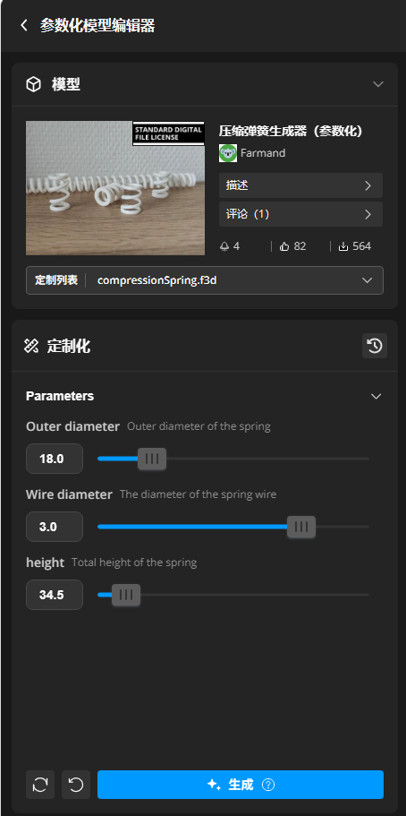
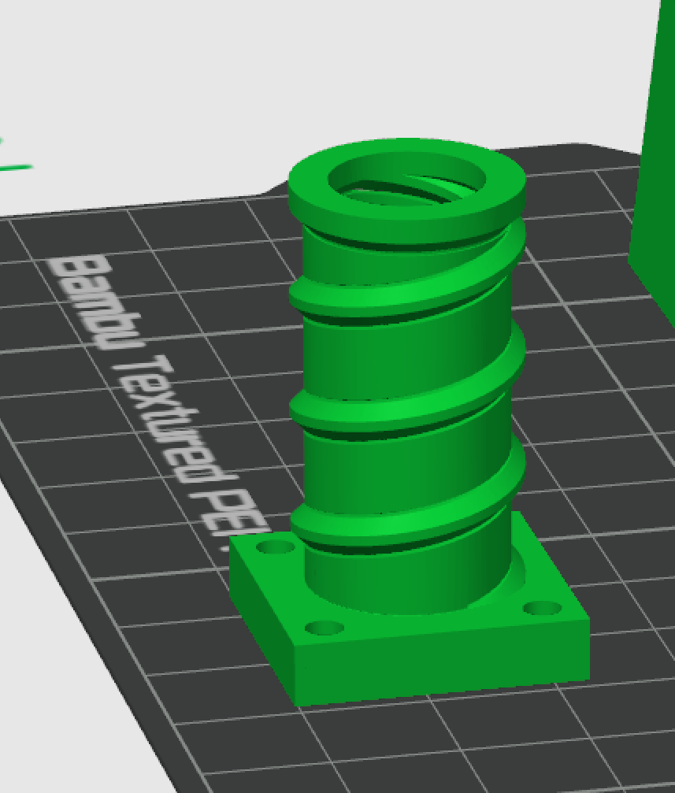
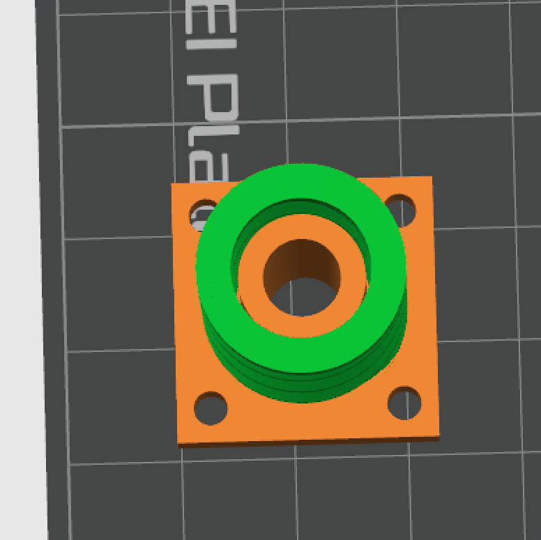

# 硬件设计与来源说明

> 本文记录打孔机的硬件构成、CAD 模型、以及各项外部来源与许可事宜。
> 坐标/参数/上机校验请看 [MACHINE.md](MACHINE.md);上位机架构见 [DEVELOPMENT.md](DEVELOPMENT.md)。

---

## 1. 硬件构成

| 部分 | 说明 | 来源 |
|---|---|---|
| **运动控制** | 三轴(GRBL 写字机型):X = 纸带横向(音调)、Y = 纸带纵向送带(时间)、Z = 冲针压下冲孔 | — |
| **控制系统(控制板/驱动)** | **型号 CMS3** | 购自"小政哥的店铺"(**商业成品**,非本项目分发) |
| **控制软件(发送 G-code / 手动控制)** | **GRBL-Plotter** | 第三方开源软件(作者 svenhb),本项目**不修改、不分发**,仅配套使用 |
| **冲孔机构** | 冲头/冲头滑块/导向架/打孔支撑垫板等,含 3D 打印件 | 本项目作者设计(见 `HardWare_Model/`) |
| **冲头压纸弹簧** | 3D 打印压缩弹簧(**个人打印自用**) | 由 **MakerWorld 的「压缩弹簧生成器(参数化)」**生成;其模型文件**不随本仓库分发**(见 §3) |
| **纸带** | 70mm 宽,有效音频区 57.5mm(详见 [MACHINE.md](MACHINE.md))。**机器打孔不需要带网格的手工纸带**,用空白廉价纸卷即可;选型、用量与实测平替见 [README「纸带」一节](../README.md#纸带选什么买多少) | — |

> 说明:上位机(MusicBox Tape Studio,本仓库)**只负责生成 G-code**;
> 把 G-code 发送给控制板并执行的动作,由 GRBL-Plotter(或其它 GRBL 发送端)完成。

---

## 2. CAD 模型目录(`HardWare_Model/`)

作者使用 **Creo Parametric(`.prt`)** 设计的装配与零件,以及标准件模型:

| 类别 | 文件(示例) |
|---|---|
| 关键功能件 | `冲头.prt` `冲头2.prt` `冲头3.prt` `冲头滑块.prt` `打孔支撑垫板.prt` `导向架.prt` |
| 框架/挡板 | `前挡板.prt` `后挡板.prt` `运动平台.prt` |
| 送带机构 | `Y轴滚纸辗滑槽.prt` `滚纸辗.prt` `滚纸辗2.prt` `辊子限位.prt` `Y轴从动辊张紧器.prt` |
| 张紧/X 轴 | `X轴张紧器.prt` `X轴张紧器弹簧座.prt` `Z轴42电机固定架.prt` |
| 总装 | `总装配.prt` |
| 3D 打印排版 | `打印.3mf`(BambuStudio 导出,4 个打印盘)—— **只含自绘零件,已入库**;它**不含**压纸弹簧(原因见 §3) |
| 标准件(外购) | `标准模型/*.step` `*.prt`(来自**嘉立创** jlcfa.com 标准件库:步进电机 42J1825、轴承 608ZZ、同步带轮、螺栓等) |

### 关于 STEP 与 `.prt` 的可用性

`.prt` 是 **Creo 专有格式**,未安装 Creo 的人无法打开。若希望他人(或社区)能复现/修改硬件,
建议**同时导出 STEP(AP214/AP203)通用格式**放入 `HardWare_Model/STEP/`。

---

## 3. 外部来源与许可

> ⚠️ **上传/分发前请确认各来源的许可条款**;下表为归类与提示,不构成法律意见。

| 来源 | 用途 | 许可提示 |
|---|---|---|
| **[MakerWorld「压缩弹簧生成器(参数化)」](https://makerworld.com.cn/zh/models/1513277-ya-suo-dan-huang-sheng-cheng-qi-can-shu-hua?from=search#profileId-1652547)** | 生成"冲头压纸弹簧"3D 模型(**仅个人打印自用**) | 该作品以 **Standard Digital File License** 授权:明令禁止以任何方式**分享/分许可/出售/出租/托管/转让/分发**其数字或 3D 打印版本、**及其衍生作品**(含二次创作、在其他数字平台上的托管);且未经许可不得收费使用。**不收费也不能豁免** —— 因此本仓库**不收录**该弹簧的任何数字文件(含由其派生/排版的 `.3mf`),仅在文档中做**署名与来源说明**+**参数与合装教程**(见 §7) |
| **嘉立创(jlcfa.com)标准件库** | 轴承/电机/带轮/紧固件等标准件 3D 模型 | 属厂商提供的选型参考资料,版权归原厂商;仅用于设计装配参考 |
| **"小政哥的店铺" CMS3 控制系统** | 运动控制板(商业成品) | **不要**上传其固件、上位机安装包、说明书等受版权保护的资料;仓库只保留"型号与来源"的文字声明 |
| **GRBL-Plotter** | 控制软件(G-code 发送) | 第三方开源项目,**独立分发**,本项目不收录其代码;其许可与使用方式以其官方仓库/发布页为准 |

### 关于「Standard Digital File License」的合规要点(重要)

对作者提供的这条协议,准确理解是:

- ❌ **禁止的是"分发/托管"本身**,与是否收费**无关**;"免费开源"不能作为豁免理由。
- ❌ 明文包含"**衍生作品**"(二次创作、在其他数字平台托管)→ 由该生成器产出、或在其基础上改的模型文件,同样不能上传。
- ❌ 与 **GPL-3.0 存在冲突**:GPL 要求允许下游再分发,而该协议禁止再分发;把两者放进同一仓库会自相矛盾。
- ✅ 一般**可以**做的:在自己机器上打印**自用**;在文档中**署名并链接来源**(如本文件与 `THIRD_PARTY.md` 所做);
  给出**尺寸参数与合装步骤**(本文件 §7,由使用者自行生成)同样不构成分发。
- ⚠️ **需要授权**的:把该弹簧的模型/打印件用于**收费**用途(例如出售整机或成品、按件收费用)。
- ✅ **合规替代**(推荐,可自由再分发):
  1. **自己参数化建模**弹簧(CAD 螺旋扫描即可,给出线径/外径/自由长度/有效圈数等参数);
  2. 使用**开源/CC0** 的弹簧生成工具或脚本(自行编写参数化脚本亦可);
  3. 仓库中只给**文字参数**(尺寸/圈数/材料),不附带任何模型文件;
  4. 若确需使用该模型并对外分发,向原作者**申请授权**(MakerWorld 上通常有商用/授权通道)。

---

## 4. 上传前建议清理的元数据(隐私)

作者在整理时检测到硬件文件内嵌了以下元数据,**上传公网会暴露本机环境或第三方署名**:

| 文件类型 | 内嵌内容 | 建议 |
|---|---|---|
| `*.log`(嘉立创导出日志) | 第三方作者名(如 `Author 刘超`)、本机绝对路径(`E:\Mod\...`) | **已在 `.gitignore` 中排除**,不入库 ✅ |
| `*.prt`(Creo 文件) | 创建者/路径元数据(如 `C:\Users\ADMINI...`、`Administrator`) | 二进制内嵌,**无法简单清除**。风险低(用户名常见),但若在意:在 Creo 中"另存"或改用导出的 **STEP** 分发;也可只入库 STEP 而不入库 `.prt` |
| `打印.3mf` | `DesignerUserId`(Bambu 账号数字 ID `1486360542`)、空的 Designer/License/Copyright 字段 | 风险低(只是数字 ID),**已随仓库分发**;若在意可用切片器重新导出该 3mf 以清空该字段 |

---

## 5. 与上位机的接口

上位机只依赖以下"约定",与具体机械解耦:

1. 纸带几何:宽 70mm、有效区 57.5mm、30 列(列距 57.5/29);
2. 坐标系与 Z 三层(X0 = 纸带左边缘;**Z 三层 = 工作高度 10 / 安全高度 4 / 移动高度 0**,可在 GUI ⑤ 调整);
3. G-code 方言:GRBL 兼容的 `G21/G90/G94`、`G0/G1/G4`、`M30`。

以上全部参数集中在 `server/gcode.py` 的 `MachineParams`,换机器时改这里即可(无需改其它模块)。

---

## 7. 冲头压纸弹簧:自己生成 + 与自绘零件合装

弹簧**不由本仓库分发**(许可原因见 §3),但它由 MakerWorld 的参数化生成器产出,任何人都能按同样参数生成一个。
下面是完整流程,README 的「冲头压纸弹簧:自己生成并合装」一节也引用了这三张图。

### 7.1 用参数化生成器出弹簧

在 [MakerWorld「压缩弹簧生成器(参数化)」](https://makerworld.com.cn/zh/models/1513277-ya-suo-dan-huang-sheng-cheng-qi-can-shu-hua?from=search#profileId-1652547)
页面点击 **Customize / 参数化自定义**,按机器实际需要的弹力设定参数(线径、外径、自由长度、有效圈数、端部形式等),再导出 STL/3MF:

> 各参数影响:**线径/外径**决定弹力与所需压纸力,**自由长度**要略大于"冲针抬起后到纸带的间隙",
> **有效圈数**越多越软。压纸力只需让纸带不跳动,过大会顶住冲针、影响孔位精度。

### 7.2 与自绘零件合装

得到弹簧模型后,在 BambuStudio 里把它**导入到同一盘中**,摆到冲头滑块下方(与 `打印.3mf` 中的零件同一个坐标系),
即成为完整的压纸机构:

> ⚠️ **合装后的盘不要再对外分发**:一旦把弹簧并入排版,这个 `.3mf` 就成了该作品的**衍生作品**,
> 受 Standard Digital File License 约束(§3)。本仓库的 `打印.3mf` 因此**只含自绘零件**;
> 弹簧这一件请各自在本机生成、本机打印。
